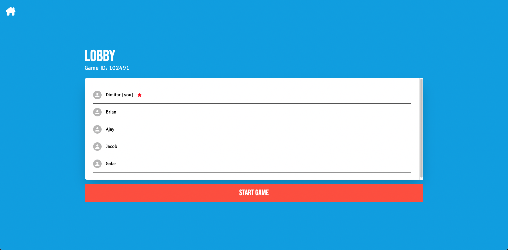
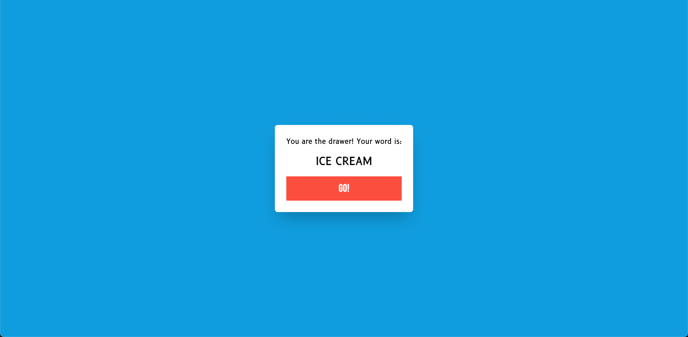
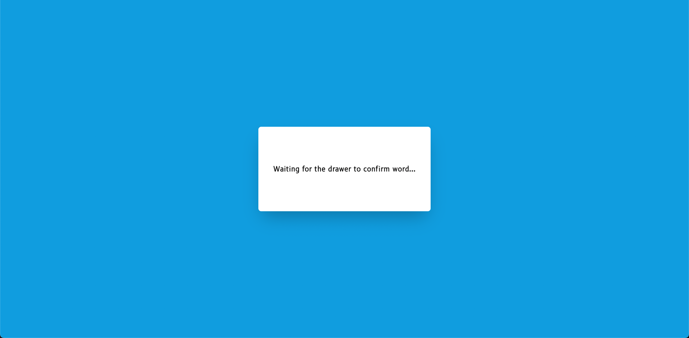
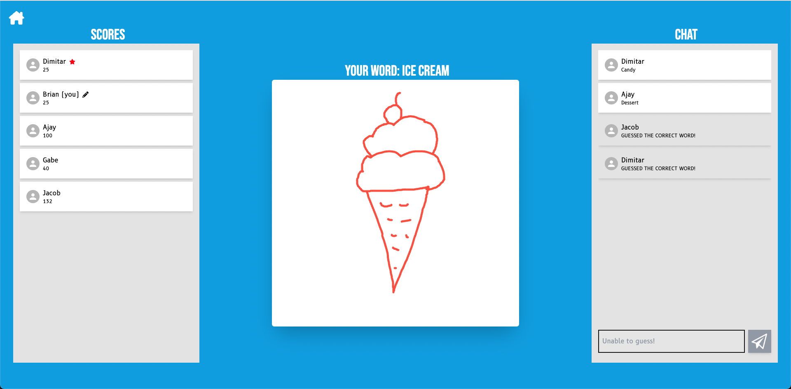
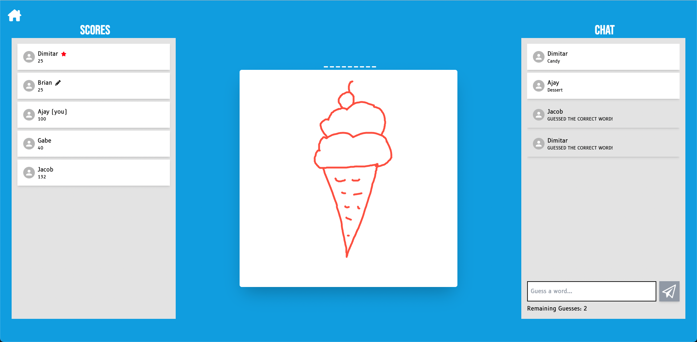

# About

Sketch Royale is a web-based, multiplayer, drawing, and guessing game. Similar to the widely recognized board game Pictionary, participants take turns drawing images that depict words or phrases, while other players attempt to guess the word or phrase and receive points for correct guesses.

# Technologies Used

We used React, TypeScript, and Tailwind for the frontend, and Node.js with JavaScript for the backend. We also used WebSockets for inter-process communication.

# Getting Started

### Running the frontend

1. Change into the frontend directory by running `cd frontend`
2. Install the necessary packages with `npm install`
3. Start the frontend using `npm run dev`
4. Visit [localhost:5173](localhost:5173)

### Running the backend
Our default configuration uses the University of Calgary Linuxlab servers to host our backend. To run the app locally, you must modify the frontend to access your local server instances instead.
1. Find the _servers_ array in [ConnectionContext.tsx](frontend/src/context/ConnectionContext.tsx)
2. Change the array to the following:  ```const servers = [
    "ws://localhost:8080",
    "ws://localhost:8081",
    "ws://localhost:8082"
  ];```
3. This will require you to run the backend servers locally. We are utilizing passive replication to provide fault tolerance in case a server crashes, so you must spin up 3 instances of the backend server
4. To get the backend up and running, open 3 terminals and in each one change into the backend directory by running `cd backend` and then `npm install`
5. In the first terminal run `node index.js 8080`
6. In the second terminal run `node index.js 8081`
7. In the third teminal run `node index.js 8082`
8. The backend is now up and running

# Demo
From the home page, you can either create a new game, or join an existing one   

  

Once in a lobby, you can share the Game ID with your friends, and the host can start the game once everybody is in

  

When a new round begins, the drawer needs to confirm the word while the remaining players wait for the round to begin  



Once the game begins, the drawer needs to draw the word on the board, while the other players try and guess what the drawing is

